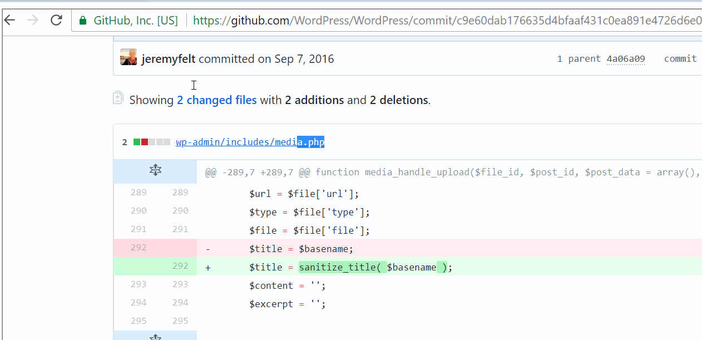
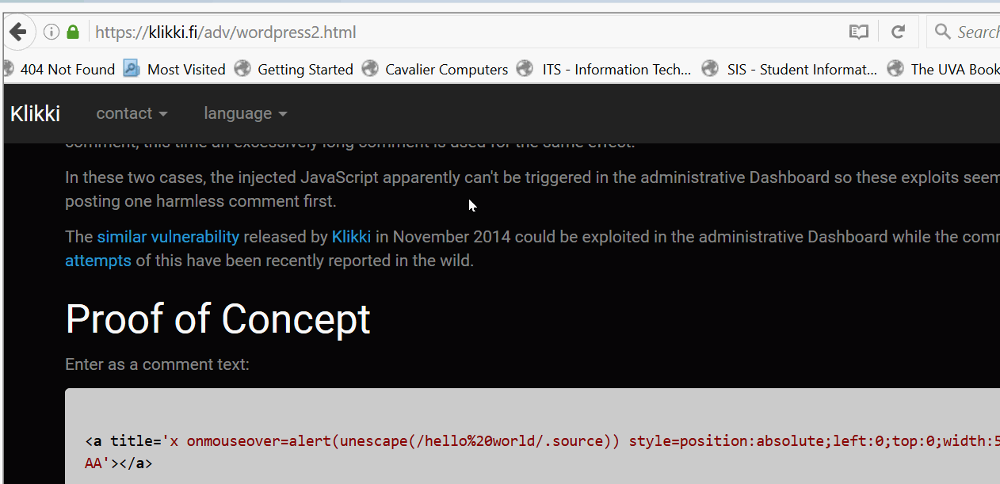
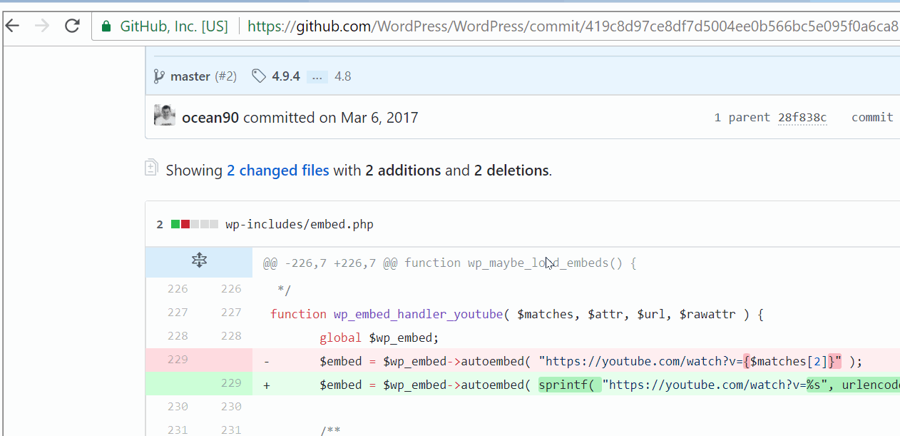
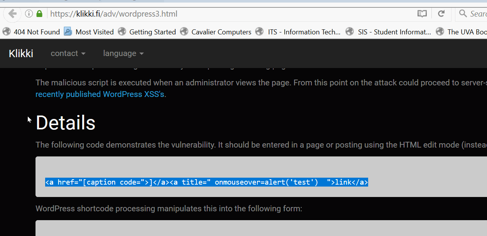

# Project 7 - WordPress Pentesting

Time spent: **X** hours spent in total

> Objective: Find, analyze, recreate, and document **five vulnerabilities** affecting an old version of WordPress

## Pentesting Report

1. Authenticated Stored Cross Site Scripting via Image Filename
  - [ ] Summary: Exploit site by inserting malicious code into the filename of an image
    - Vulnerability types:XSS
    - Tested in version:4.2
    - Fixed in version: 4.2.10
  - [ ] GIF Walkthrough: 
  - [ ] Steps to recreate: 
  1. Insert a new image under the media tab
  2. Set the title of the image to be XSS attack code ()
  3. Publish post and view new post.
  - [ ] Affected source code:
    - wpdistillery.vm/wp-admin/includes/media.php
2. Unauthenticated Stored Cross-Site Scripting (XSS) (Long Comment)
  - [ ] Summary: Exploit site by inserting malicious code and creating a 64KB comment in response to a post
    - Vulnerability types:XSS
    - Tested in version:4.2
    - Fixed in version: 4.2.1
  - [ ] GIF Walkthrough: 
  - [ ] Steps to recreate: 
  1. Create a new post
  2. Log out of your account
  3. View post as someone other than the admin and write a comment
  4. Insert malicious code and 64KB message into the comment ()
    5. As an admin view post
  - [ ] Affected source code:
    - wpdistillery.vm/firsttry/comment#6
3. Authenticated Stored Cross-Site Scripting (XSS) in YouTube URL Embeds
  - [ ] Summary: Exploit site by inserting malicious code into the URL of a youtube video link
    - Vulnerability types:XSS
    - Tested in version:4.2
    - Fixed in version: 4.2.13
  - [ ] GIF Walkthrough: 
  - [ ] Steps to recreate:
  1. Create a new post
  2. Insert youtube video link into post
  3. Insert malicious code into the end of the youtube link (https://www.youtube.com/watch?v=)
  4. Embed link into post
  5. View post
  - [ ] Affected source code:
    - wpdistilllery.vm/wp-includes/embed.php
4. Authenticated Stored Cross-Site Scripting (XSS) hover
  - [ ] Summary: Exploit site by creating a inserting malicious code into a link that when you hover over the link returns an error message.
    - Vulnerability types:XSS
    - Tested in version:4.2
    - Fixed in version: 4.2.3
  - [ ] GIF Walkthrough: 
  - [ ] Steps to recreate: 
  1. Create a new post
  2. In the body of the post insert malicious code (<a href="[caption code=">]</a><a title=" onmouseover=alert('test')  ">link</a>)
  3. View post and hover over link
  - [ ] Affected source code:
    - wpdistillery.vm/wp-admin/post.php?post=19&action=edit

## Assets

List any additional assets, such as scripts or files

## Resources

- [WordPress Source Browser](https://core.trac.wordpress.org/browser/)
- [WordPress Developer Reference](https://developer.wordpress.org/reference/)

GIFs created with [LiceCap](http://www.cockos.com/licecap/).

## Notes

It was definitely hard at first just to wrap my head around what we were supposed to be doing and what parts of wordpress we were supposed to be trying to exploit. However, once I identified a few vulnerabilities it became pretty clear how to do  the rest of them.

## License

    Copyright [yyyy] [name of copyright owner]

    Licensed under the Apache License, Version 2.0 (the "License");
    you may not use this file except in compliance with the License.
    You may obtain a copy of the License at

        http://www.apache.org/licenses/LICENSE-2.0

    Unless required by applicable law or agreed to in writing, software
    distributed under the License is distributed on an "AS IS" BASIS,
    WITHOUT WARRANTIES OR CONDITIONS OF ANY KIND, either express or implied.
    See the License for the specific language governing permissions and
    limitations under the License.
